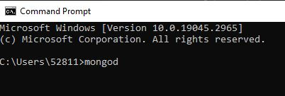
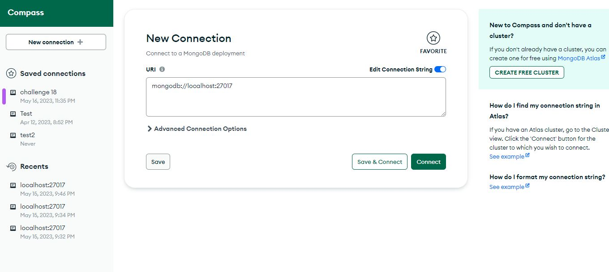
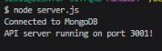

# Fabrizio Treviño NoSQLSocial Network API

This project is a challenge to build an API for a social network web application using a NoSQL database. The API allows users to share their thoughts, react to friends' thoughts, and create a friend list. The technologies used include Express.js for routing, MongoDB for the database, and Mongoose as the ODM (Object Data Modeling) tool.

## Objective

The objective of this project is to develop a robust API for a social network application that can handle large amounts of unstructured data. The API should be able to perform CRUD (Create, Read, Update, Delete) operations on users, thoughts, reactions, and friend lists.

## User Story

As a developer, I want to create notes or code snippets with or without an internet connection so that I can reliably retrieve them for later use.

## Technologies Used

- Express.js
- Mongoose
- MongoDB
- Moment.js

## Getting Started

- Clone the starter code repository from [GitHub](https://github.com/Fabri-Tech/Fabrizio-Trevino-Social-Network-NoSQL).

- Intall the necesary packages using "npm i + dependencies" in the terminal

- Open te the terminal and type "mongod"

- Open Mongodb

- Finally run the server using "node server.js"

Once it is running make sure to write the correct local host in insomnia and start working.

Make sure your

## Deployement link

Please watch the following walkthrough video for a demonstration of the application's functionality [link to video](https://drive.google.com/file/d/1pr2hAbzsjJC7KR5ejmBt0T4lD_jyiw0Q/view)

## GitHub Repositories

[My Repositories](https://github.com/Fabri-Tech?tab=repositories)

[Assigment Repository](https://github.com/Fabri-Tech/Fabrizio-Trevino-Social-Network-NoSQL)
